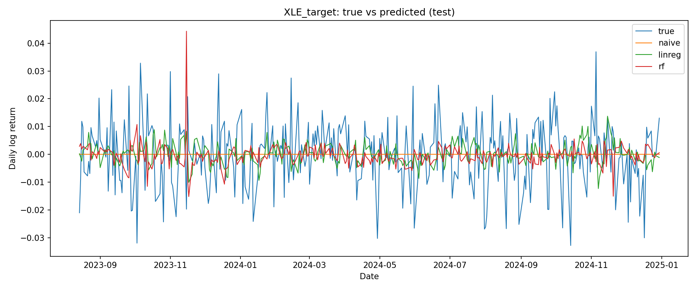
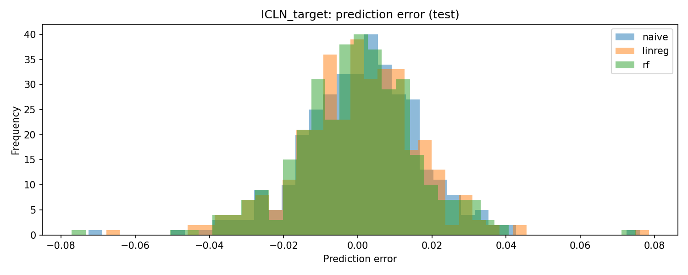
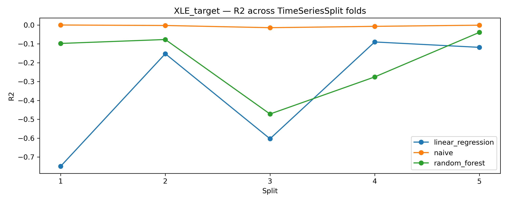
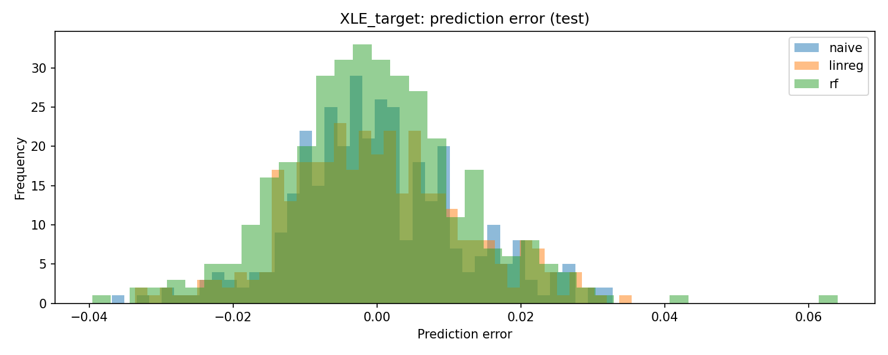
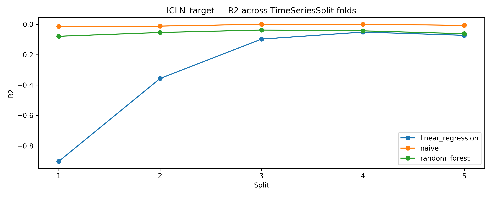

\thispagestyle{empty}

\vspace*{3cm}

\begin{center}
{\LARGE \textbf{Impact of Oil Prices on the Stock Performance of Fossil and Renewable Energy Sectors}}\\[2cm]

{\large Luca Schweblin}\\[0.5cm]
{\large \textit{Université de Lausanne}}\\[0.3cm]
{\large MSc. in Finance}\\[0.3cm]
{\large luca.schweblin@unil.ch}
\end{center}

\newpage
\pagenumbering{arabic}

\tableofcontents
\newpage

# Abstract

**This project examines how crude oil price dynamics relate to the financial performance of energy-sector equities, with a focus on differences between fossil fuel and renewable energy markets. Using daily data from 2018–2024 for WTI crude oil futures (CL=F), the Energy Select Sector SPDR Fund (XLE), and the iShares Global Clean Energy ETF (ICLN), prices are transformed into log-returns and used in a forecasting setup. Predictors are constructed from lagged oil returns and rolling-window statistics to capture delayed and local effects. Predictive performance is assessed with an interpretable multiple linear regression benchmark and a Random Forest regressor to allow for nonlinearities and interactions. Evaluation relies on a strict chronological train–test split and a walk-forward validation procedure to avoid information leakage and to study temporal stability. The results suggest a relatively stronger sensitivity in error metrics between oil dynamics and fossil fuel equities (XLE), while predictive performance for renewable energy equities (ICLN) appears weaker and less consistent across time. An event-based oil shock analysis further indicates more pronounced and directionally consistent reactions for XLE, whereas ICLN responses are more diffuse. Overall, oil-related information appears more informative for forecasting fossil-sector returns than renewable-sector returns at a daily frequency.**

# Introduction

Energy markets have historically been strongly influenced by fluctuations in crude oil prices (Hamilton, 2009). As a key input for transportation, industry, and electricity generation, oil prices affect production costs, investment decisions, and ultimately the valuation of energy-related firms. Consequently, the financial performance of fossil fuel companies has long been closely tied to movements in oil prices, both in levels and in volatility (Sadorsky, 2001).

Over the past two decades, however, the global energy landscape has undergone a significant transformation with the rapid expansion of renewable energy technologies (Agency, 2023b). Solar, wind, and other clean energy sources are increasingly integrated into energy systems, supported by technological progress, regulatory frameworks, and growing environmental concerns. This transition raises an important question for financial markets: to what extent do renewable energy assets remain exposed to oil price dynamics, and do they exhibit different behavior compared to traditional fossil fuel assets?

While a large body of literature documents the relationship between oil prices and energy-related stocks, existing evidence regarding renewable energy assets remains mixed (Henriques & Sadorsky, 2007). Some studies suggest a persistent dependence on oil markets, whereas others point toward a gradual decoupling as renewable technologies mature and develop distinct economic drivers. Moreover, many empirical analyses rely on static correlations (Diebold & Yilmaz, 2011) or contemporaneous relationships, which may fail to capture delayed effects, nonlinear dynamics, and regime-dependent responses, particularly during periods of extreme oil price movements.

This project aims to address these limitations by adopting a time-series forecasting perspective (Tsay, 2006d). Rather than focusing on simple correlations, the analysis evaluates whether past oil price dynamics can help predict future returns of energy-related financial assets. Specifically, the project compares the predictive relationship between crude oil returns and two representative exchange-traded funds: the Energy Select Sector SPDR Fund (XLE), representing fossil fuel companies, and the iShares Global Clean Energy ETF (ICLN), representing renewable energy firms.

To this end, the project combines feature engineering based on lagged returns and rolling statistics with both linear and non-linear predictive models. A multiple linear regression model is used as an interpretable benchmark, while a Random Forest regressor is employed to capture potential nonlinearities and interactions. Model performance is assessed using a strictly chronological train–test split and a walk-forward validation framework, ensuring a realistic and leakage-free evaluation. In addition, the project includes a dedicated analysis of oil price shocks in order to examine whether fossil and renewable assets respond differently during extreme market events.

The remainder of the report is structured as follows. Section 2 reviews the relevant literature on oil prices and energy stock performance. Section 3 describes the data, feature engineering process, modeling choices, and validation strategy. Section 4 presents the empirical results, including model comparisons and shock analysis. Section 5 discusses the findings and their limitations, and Section 6 concludes with a summary of key insights and directions for future research.

# Literature Review

A substantial body of empirical literature has examined the relationship between crude oil prices and the financial performance of energy-related firms. Early studies emphasize the central role of oil as a key production input, showing that oil price fluctuations affect corporate costs, profitability, and stock valuations, particularly for firms operating in energy-intensive sectors (Hamilton, 2009).

Several empirical contributions document a strong link between oil price movements and the returns of fossil fuel companies. Using stock market data for oil and gas firms, Sadorsky (2001) finds that oil price changes constitute a significant risk factor for energy stock returns, influencing both expected returns and volatility. These findings suggest that fossil fuel firms remain closely tied to oil market dynamics, even in developed financial markets.

The relationship between oil prices and renewable energy firms appears more ambiguous. While some studies report persistent exposure of alternative energy stocks to oil price fluctuations, others highlight signs of gradual decoupling as renewable technologies mature and develop distinct economic drivers. Henriques and Sadorsky (2007) show that stock prices of alternative energy companies respond to oil price changes, though the magnitude and stability of this relationship differ from those observed for traditional energy firms.

A growing strand of the literature emphasizes methodological limitations in existing empirical approaches. Many studies rely on static correlations or contemporaneous regressions, which may fail to capture delayed effects, nonlinear dynamics, and regime-dependent responses. Diebold and Yilmaz (2011) argue that financial spillovers and interdependencies often evolve over time and may not be adequately described by static models, particularly during periods of market stress.

In addition, the time-series forecasting literature highlights the importance of respecting temporal structure and avoiding information leakage when evaluating predictive relationships. Tsay (2006) stresses that realistic forecasting performance should be assessed using strictly out-of-sample procedures, as in-sample relationships often fail to translate into predictive power.

Overall, while existing studies provide strong evidence of a link between oil prices and energy-related stock returns, important gaps remain regarding the stability, predictability, and temporal structure of this relationship. In particular, limited attention has been paid to short-horizon return forecasting under strictly chronological evaluation frameworks, as well as to systematic comparisons between fossil fuel and renewable energy assets. This project aims to address these gaps by adopting a time-series forecasting perspective combined with walk-forward validation and explicit benchmarking against naive models.

# Methodology

## Data Description
The empirical analysis relies on daily financial market data for crude oil and energy-related equity assets (XLE, ICLN). Specifically, three instruments are considered: West Texas Intermediate (WTI) crude oil futures (ticker: CL=F), which serve as a benchmark for global oil prices; the Energy Select Sector SPDR Fund (XLE), representing publicly traded fossil fuel companies; and the iShares Global Clean Energy ETF (ICLN), representing firms operating in the renewable energy sector. All data are retrieved from Yahoo Finance (Yahoo Finance, 2025).

The sample covers the period from 2018 to 2024, corresponding to approximately 1,500 daily trading observations per asset. This time span includes heterogeneous market conditions, including periods of high volatility, making it suitable for a time-series analysis of energy market dynamics. All price series are aligned on common trading dates and sorted chronologically to ensure temporal consistency across assets. Observations with missing values are removed in order to construct a balanced dataset.

To facilitate meaningful comparisons and reduce non-stationarity, daily prices are transformed into logarithmic returns. Log-returns are computed as the first difference of the natural logarithm of prices, which is standard practice in financial time-series analysis. This transformation stabilizes the variance of the series and allows returns across different assets to be analyzed on a comparable scale.

After the transformation, the analysis is conducted exclusively on return series rather than price levels. This choice reflects a forecasting-oriented perspective, as returns are the relevant quantity for asset pricing and risk evaluation. The return series are subsequently augmented with lagged values and rolling-window statistics, resulting in a multivariate feature set used for predictive modeling. The resulting dataset constitutes the basis for subsequent feature engineering and modeling steps.

## Approach
This project adopts a time-series forecasting framework to assess the predictive relationship between crude oil returns and the returns of energy-related equity assets. The methodological design ensures temporal consistency, prevents information leakage, and enables a robust comparison between linear and non-linear predictive models.

### Feature Engineering
The analysis is based on the assumption that the impact of oil price movements on energy-related assets may occur with temporal delays rather than instantaneously. To capture these delayed effects, a set of lagged return features is constructed. Specifically, lagged values of daily log-returns are generated at horizons of 1, 2, 3, 5, and 10 trading days, capturing short- and medium-term dependencies in return dynamics.

In addition to lagged returns, rolling-window statistics are computed to account for local trends and smoothed market behavior. Rolling averages of returns are calculated over windows of 5, 10, and 20 trading days. These features introduce information about recent return dynamics while reducing the influence of day-to-day noise.

All features are computed exclusively using past information. Observations with missing values arising from lagging and rolling operations are removed to ensure a clean and consistent feature matrix.

### Target Variable Definition
The modeling task is formulated as a genuine forecasting problem. The target variable is defined as a future return, obtained by shifting the return series forward in time. As a result, the feature set at time \( t \) is used to predict returns at time \( t + h \), where \( h \) denotes the forecast horizon.

This explicit temporal shift ensures that no future information is included among the predictors and prevents any form of data leakage. The resulting setup reflects a realistic forecasting scenario consistent with financial decision-making.

### Models
Two regression-based models are considered. First, a multiple linear regression model is used as an interpretable benchmark. This model provides a baseline assessment of whether a linear combination of lagged oil-related features can explain future returns of energy-sector assets.

Second, a Random Forest regressor is employed to capture potential nonlinear relationships and interactions between features. By aggregating multiple decision trees, the Random Forest model is able to model complex patterns that may not be adequately represented by a linear specification.

The comparison between these two approaches allows for an evaluation of whether increased model complexity yields meaningful gains in predictive performance.

### Baseline Model
To contextualize model performance, a naive baseline forecast is implemented. The baseline assumes that the return at the next time step is equal to the most recently observed return. This simple rule serves as a minimal benchmark and represents a scenario in which no predictive structure is exploited.

A model is considered informative only if it consistently outperforms this naive benchmark.

### Validation Strategy and Evaluation Metrics
Given the time-series nature of the data, the dataset is split chronologically into training and testing subsets, with approximately 80% of observations used for training and the remaining 20% reserved for evaluation. No random shuffling is applied.

Beyond a single train–test split, a walk-forward validation procedure is implemented to assess the stability of model performance over time. In this framework, models are re-estimated sequentially on expanding training windows and evaluated on subsequent observations. This approach provides insight into how predictive performance evolves across different market regimes and mitigates the risk of results being driven by a specific sample period.

Model performance is evaluated using three standard regression metrics: the Root Mean Squared Error (RMSE), the Mean Absolute Error (MAE), and the coefficient of determination (\( R^2 \)). These metrics provide complementary perspectives on prediction accuracy, error magnitude, and explanatory power. All evaluations are conducted strictly out of sample.

# Implementation

## Languages and libraries
The project is implemented in **Python** using standard data-science libraries:
- **Data handling**: pandas, numpy
- **Data acquisition**: yfinance
- **Modeling and evaluation**: scikit-learn (LinearRegression, RandomForestRegressor, metrics, preprocessing)
- **Visualization**: matplotlib
- **Utilities**: pathlib (file and directory management)

## System architecture
The workflow is organized as a modular notebook pipeline, where each notebook corresponds to a clearly defined stage:
1. **Data download** (Yahoo Finance) and alignment of trading dates
2. **Return construction** (log-returns) and dataset cleaning
3. **Feature engineering** (lags and rolling-window statistics)
4. **Modeling** (baseline, linear regression, random forest) and out-of-sample testing
5. **Walk-forward validation** to assess stability across time
6. **Oil shock analysis** to study extreme oil price movements and asset responses
7. **Economic interpretation** and summary outputs (tables/plots saved to disk)

This structure ensures reproducibility and minimizes the risk of information leakage by maintaining strict chronological processing throughout the pipeline.

## Key code components
Key reusable components include:
- Feature construction utilities (lagged returns, rolling statistics)
- Forecasting setup (target shifting to predict \(t+h\))
- Evaluation utilities to compute out-of-sample metrics (RMSE, MAE, \(R^2\))
- Walk-forward validation loop (expanding window re-estimation and sequential evaluation)
- Shock identification and event-window aggregation for extreme oil moves

## Example code snippet
The following excerpt illustrates the walk-forward validation procedure implemented with an expanding training window and sequential out-of-sample evaluation.

```python
from sklearn.pipeline import Pipeline
from sklearn.preprocessing import StandardScaler
from sklearn.linear_model import LinearRegression
from sklearn.ensemble import RandomForestRegressor

results = []
targets = target_cols  # list of forecast targets defined upstream

for split_id, (train_idx, val_idx) in enumerate(tscv.split(X_train), start=1):
    X_tr = X_train.iloc[train_idx]
    X_val = X_train.iloc[val_idx]

    for target in targets:
        y_tr = y_train[target].iloc[train_idx]
        y_val = y_train[target].iloc[val_idx]

        # Naive benchmark: zero return
        y_pred_naive = np.zeros(len(y_val))

        lr_pipeline = Pipeline(
            steps=[
                ("scaler", StandardScaler()),
                ("model", LinearRegression()),
            ]
        )
        lr_pipeline.fit(X_tr, y_tr)
        y_pred_lr = lr_pipeline.predict(X_val)

        rf_model = RandomForestRegressor(
            n_estimators=200,
            random_state=42,
            n_jobs=-1,
        )
        rf_model.fit(X_tr, y_tr)
        y_pred_rf = rf_model.predict(X_val)

        for model_name, y_pred in [
            ("naive", y_pred_naive),
            ("linear_regression", y_pred_lr),
            ("random_forest", y_pred_rf),
        ]:
            metrics = compute_metrics(y_val, y_pred)
            metrics["split"] = split_id
            metrics["target"] = target
            metrics["model"] = model_name
            results.append(metrics)
```
# Codebase and Reproducibility
The full codebase is publicly available on GitHub.  
To reproduce the results, clone the repository, install the required Python dependencies (e.g., `pip install -r requirements.txt`), and run `python main.py` from the project root.  
All tables and figures reported in this paper are automatically generated and saved to the `outputs/` directory.

# Results

## Experimental Setup
All experiments are conducted using a strictly chronological evaluation framework to respect the time-series structure of the data and prevent information leakage. Model performance is assessed using both a fixed out-of-sample test set and a walk-forward validation procedure based on expanding training windows over time.

The implementation is carried out in Python using pandas and numpy for data handling and scikit-learn for modeling and evaluation. The Random Forest model is trained with 200 trees (`n_estimators = 200`), a fixed random seed (`random_state = 42`), and parallel execution enabled. Linear regression is estimated within a pipeline including feature standardization.

## Performance Evaluation

Model performance is evaluated using RMSE, MAE, and \(R^2\), computed strictly out of sample. Results are reported separately for fossil fuel assets (XLE) and renewable energy assets (ICLN) and compared against a naive benchmark.

**Table 1.** *Reports performance on the held-out test set.*

| target      | model             |     RMSE |      MAE |        R2 |
|:------------|:------------------|---------:|---------:|----------:|
| ICLN_target | Linear Regression | 0.016351 | 0.012443 | -0.057151 |
| ICLN_target | Naive             | 0.015938 | 0.012119 | -0.004429 |
| ICLN_target | Random Forest     | 0.016238 | 0.012232 | -0.042621 |
| XLE_target  | Linear Regression | 0.012148 | 0.009587 | -0.096209 |
| XLE_target  | Naive             | 0.011603 | 0.008957 | -0.000002 |
| XLE_target  | Random Forest     | 0.012588 | 0.009593 | -0.176936 |

Overall, none of the predictive models consistently outperform the naive benchmark on the held-out test set. 
For both XLE and ICLN, predictive accuracy remains limited, with negative out-of-sample \(R^2\) values across models, indicating that simple benchmarks are difficult to beat in short-horizon financial return forecasting.
Linear Regression and Random Forest exhibit comparable error magnitudes, suggesting limited gains from increased model complexity.

**Table 2.** *Walk-forward (expanding window) validation performance (mean and standard deviation across folds).*
\begingroup
\small

| target      | model             |   mean_RMSE |   std_RMSE |   mean_MAE |   std_MAE |   mean_R2 |   std_R2 |
|:------------|:------------------|------------:|-----------:|-----------:|----------:|----------:|---------:|
| ICLN_target | Linear Regression |    0.021453 |   0.007433 |   0.015337 |  0.003926 | -0.296102 | 0.360677 |
| ICLN_target | Naive             |    0.019445 |   0.007016 |   0.014151 |  0.004420 | -0.006826 | 0.006722 |
| ICLN_target | Random Forest     |    0.019902 |   0.007103 |   0.014537 |  0.004537 | -0.058645 | 0.021341 |
| XLE_target  | Linear Regression |    0.024926 |   0.010035 |   0.018042 |  0.005346 | -0.342568 | 0.309667 |
| XLE_target  | Naive             |    0.022135 |   0.009947 |   0.016151 |  0.005543 | -0.004989 | 0.005878 |
| XLE_target  | Random Forest     |    0.023999 |   0.010310 |   0.017231 |  0.005860 | -0.192473 | 0.177689 |

\endgroup

The walk-forward validation results confirm the lack of stable predictive performance over time.
Across expanding training windows, average \(R^2\) values remain negative for all models and both assets, with substantial variability across folds.
These results suggest that predictive relationships, when present, are weak and unstable across different market periods. 

## Visualizations

Figure 1 illustrates out-of-sample predicted versus realized returns for XLE, highlighting the limited ability of the models to track short-term return dynamics.

Figure 2 reports the distribution of prediction errors for ICLN, showing centered but wide error distributions consistent with weak predictive power.

Figure 3 presents the evolution of out-of-sample \(R^2\) over time under the walk-forward validation framework, emphasizing the temporal instability of model performance. 

These empirical findings provide the basis for the economic interpretation and discussion presented in the next section.







\clearpage

# Discussion

This section interprets the empirical results obtained in the previous section and relates them to the objectives of the project. The discussion focuses on model performance, methodological challenges, and the implications of the findings for oil–energy return predictability.

**What worked well.**  
The project successfully implements a rigorous time-series forecasting framework that respects the temporal structure of financial data. The use of strictly out-of-sample evaluation, combined with a walk-forward validation procedure, ensures that results are free from information leakage and robust to changing market conditions. The comparison between a simple linear benchmark and a nonlinear Random Forest model provides a meaningful assessment of whether model complexity improves predictive performance. In addition, the separation between fossil fuel (XLE) and renewable energy (ICLN) assets allows for a direct comparison across different segments of the energy market.

**Challenges encountered.**  
A key challenge lies in the inherently low signal-to-noise ratio of daily financial returns. Despite extensive feature engineering based on lagged returns and rolling statistics, predictive signals remain weak. This limitation is reflected in the consistently negative out-of-sample \(R^2\) values across models and validation schemes. Another challenge concerns model stability: walk-forward results reveal substantial variability in performance across folds, suggesting that relationships between oil prices and energy asset returns are not stable over time.

**Comparison with expectations.**  
The initial motivation of the project was to assess whether oil price dynamics contain predictive information for energy-sector returns, and whether renewable assets exhibit different behavior compared to fossil fuel assets. The results provide limited support for strong predictive relationships. While some differences in error magnitudes between XLE and ICLN are observed, neither asset class exhibits consistently exploitable predictability. These findings are consistent with the view that short-horizon return forecasting in liquid financial markets is challenging, and that any dependence on oil price movements is weak and unstable.

**Limitations.**  
Several limitations should be acknowledged. First, the analysis focuses on daily data and short forecast horizons, which may obscure longer-term relationships. Second, the feature set is restricted to price-based information and does not incorporate macroeconomic variables, firm-level fundamentals, or measures of market expectations. Third, the models are evaluated using standard regression metrics, which may not fully capture economic relevance from an investment perspective.

**Surprising findings.**  
An unexpected result is the lack of improvement from the Random Forest model relative to linear regression. Despite its ability to capture nonlinearities, the Random Forest does not deliver superior or more stable out-of-sample performance. This suggests that increased model complexity does not necessarily translate into better predictive accuracy in this context, and that the underlying return-generating process may be dominated by noise rather than exploitable structure.

# Conclusion

## Summary

This project investigated the relationship between crude oil price dynamics and energy-sector financial assets, with a particular focus on comparing fossil fuel (XLE) and renewable energy (ICLN) markets. Using daily data and a strictly chronological evaluation framework, the analysis combined out-of-sample testing with walk-forward validation to assess predictive performance in a robust and realistic setting.

The main empirical finding is the absence of stable and economically meaningful predictability in short-horizon energy asset returns based on oil price information alone. Across all models considered—naive benchmark, linear regression, and Random Forest—out-of-sample performance remains weak, with consistently negative \(R^2\) values. Model complexity does not lead to systematic improvements, as nonlinear methods fail to outperform simpler benchmarks.

Despite these results, the project successfully meets its methodological objectives. It demonstrates the importance of rigorous time-series validation, highlights the instability of predictive relationships over time, and provides a transparent comparison between fossil and renewable energy assets. More broadly, the findings reinforce the view that short-term return forecasting in liquid financial markets is inherently challenging and that apparent in-sample relationships may not translate into robust out-of-sample gains.

## Future Work

Several extensions could be considered to further explore the oil–energy relationship. From a methodological perspective, incorporating longer forecast horizons or regime-switching models may help capture slower-moving dynamics that are not observable at the daily frequency. Additional experiments could also involve alternative machine learning approaches, such as regularized linear models or sequence-based architectures, while maintaining strict out-of-sample evaluation.

From a data perspective, enriching the feature set with macroeconomic indicators, volatility measures, or expectations-based variables could provide additional predictive content. Finally, future work could shift the focus from statistical accuracy to economic relevance by evaluating trading strategies, risk-adjusted performance, or portfolio-level implications, offering a more applied perspective on the economic impact of oil price fluctuations.

\clearpage
# References

Hamilton, J. D. (2009). Causes and consequences of the oil shock of 2007–08. *Brookings Papers on Economic Activity*, 40(1), 215–261. https://doi.org/10.3386/w15002

Henriques, I., & Sadorsky, P. (2007). Oil prices and the stock prices of alternative energy companies. *Energy Economics*, 30(3), 998–1010. https://doi.org/10.1016/j.eneco.2007.11.001

International Energy Agency. (2023). *World Energy Outlook 2023*. https://doi.org/10.1787/827374a6-en

Diebold, F. X., & Yilmaz, K. (2011). Better to give than to receive: Predictive directional measurement of volatility spillovers. *International Journal of Forecasting*, 28(1), 57–66. https://doi.org/10.1016/j.ijforecast.2011.02.006

Sadorsky, P. (2001). Risk factors in stock returns of Canadian oil and gas companies. *Energy Economics*, 23(1), 17–28. https://doi.org/10.1016/S0140-9883(00)00072-4

Tsay, R. S. (2006). *Analysis of Financial Time Series* (2nd ed.). Technometrics, 48(2), 316. https://doi.org/10.1198/tech.2006.s405

Yahoo Finance. (2025). Financial market data. https://finance.yahoo.com/

\clearpage
# Appendices

## Appendix A: Additional Results





## Appendix B: AI Tools Used

AI tools were used as supportive instruments during this project. ChatGPT was used to assist with code drafting, debugging, and clarification of Python syntax, as well as for structuring parts of the analysis. GitHub Copilot was used to facilitate code completion and improve coding efficiency. All data processing, modeling choices, analyses, results, and interpretations were designed, implemented, and validated by the author.

## Appendix C: Code Repository

**GitHub Repository:** https://github.com/lschweb1/oil-energy-project.git